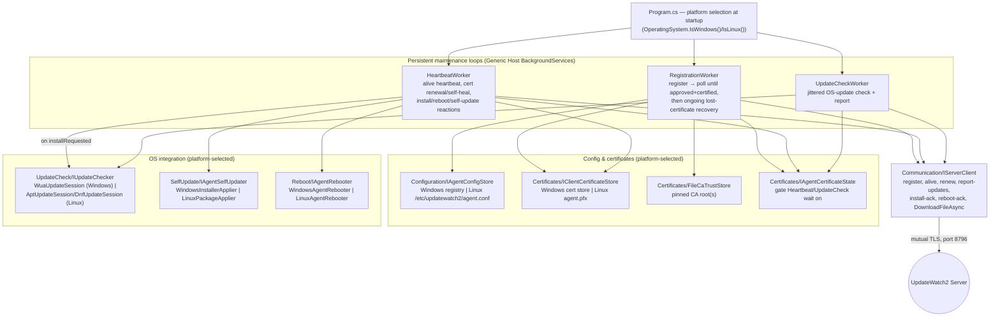
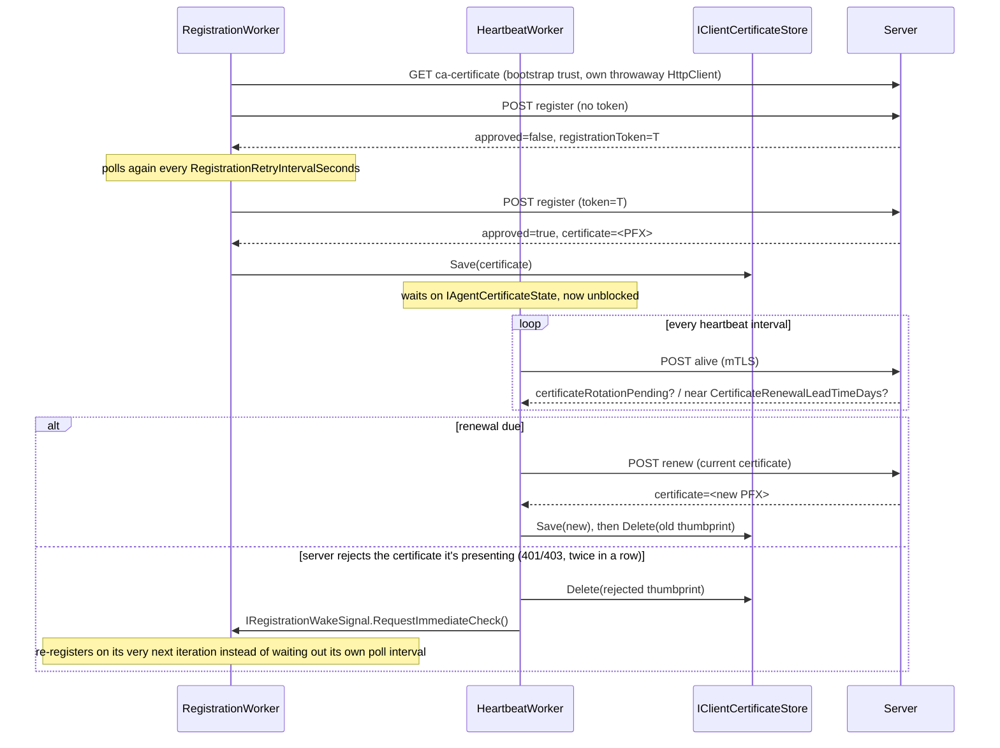

# Agent architecture

High-level view of how `updatewatch2-agent`'s own subsystems fit
together, and how they talk to the server. See the root `CLAUDE.md` for
the authoritative, exhaustively detailed repository layout and history —
this document is a map to orient from, not a replacement for it.

## Component overview

## Why three separate workers, not one

Each runs on its own cadence and gates on a different condition, and
splitting them keeps each one's own concern testable in isolation (see
`tests/UpdateWatch2.Agent.Tests/` — every one of these has hand-written
fake seams instead of a mocking library):

- **`RegistrationWorker`** is the only one that runs *before* this agent
  has a certificate, and keeps running for the process's entire
  lifetime afterward — not a run-once-at-startup task — so a certificate
  lost mid-lifetime (wiped store, admin-forced re-issuance) still gets
  noticed and recovered with no service restart.
- **`HeartbeatWorker`** and **`UpdateCheckWorker`** both wait on
  `IAgentCertificateState` before their own loops start, and do nothing
  until `RegistrationWorker` has actually produced a certificate.
- **`HeartbeatWorker`**'s cadence is deliberately short (a few minutes)
  because everything it carries — install/reboot triggers, cert renewal,
  self-heal, agent self-update — is comparatively time-sensitive.
  **`UpdateCheckWorker`**'s cadence is deliberately longer and jittered,
  since checking for OS updates is inherently a slower, heavier
  operation and many agents doing it at once would be its own problem.

## Certificate lifecycle, from this agent's side

Two platform-specific stores implement `IClientCertificateStore` and
`Certificates/FileCaTrustStore`'s CA-side counterpart — the Windows
machine certificate store (non-exportable) and
`/etc/updatewatch2/agent.pfx` (owner-only permissions) on Linux — selected
once in `Program.cs`, never via a runtime branch inside a shared class.

## The heartbeat's full checklist

Every `HeartbeatWorker` tick, in the order it happens, piggybacking as
much as possible onto one round trip rather than separate poll loops
(see the root `CLAUDE.md` for the live-verified bugs each of these caught
along the way):

1. Re-send this agent's own `DnsName`/`OperatingSystem`/`IpAddress`/
   `AgentVersion`/`BootTimeUtc` — the only channel left to refresh them
   once already certified.
2. Poll `GET /api/version` and log a warning on a protocol mismatch.
3. Fetch `GET /api/agent/ca-certificates` and merge in any new root.
4. Check this agent's own certificate against
   `CertificateRenewalLeadTimeDays`, and renew if due.
5. React to `certificateRotationPending` — renew immediately if true.
6. React to `installRequested`/`installUpdateIds` — call
   `IUpdateChecker.InstallAsync`, then `POST install-ack`.
7. React to `rebootRequested` — call `IAgentRebooter.RequestReboot`, then
   `POST reboot-ack`. Never triggered by anything else in this agent —
   see the root `CLAUDE.md`'s "update installation never triggers a
   reboot itself" rule.
8. React to `agentUpdateAvailable` — hand off to
   `SelfUpdate/IAgentSelfUpdater` (download, verify SHA-256, apply). No
   acknowledgement call: the next heartbeat after restarting on the new
   build self-reports the new version, and the server stops offering it.
9. Self-heal: two consecutive certificate-rejected responses to *any* of
   the above drop the certificate and wake `RegistrationWorker`.
10. Purely local housekeeping: `SelfUpdate/SelfUpdateStagingCleaner`
    deletes old downloaded self-update packages (keeping the most recent
    one regardless of age).

## Where to look next

- `../CLAUDE.md` — the authoritative, continuously-updated project brief;
  every subsystem's own doc comments link back to the specific issue or
  live-verification run that shaped it.
- `protocol.md` — the wire shapes each arrow above actually carries.
- `deployment.md` — how to actually install and configure this agent.
